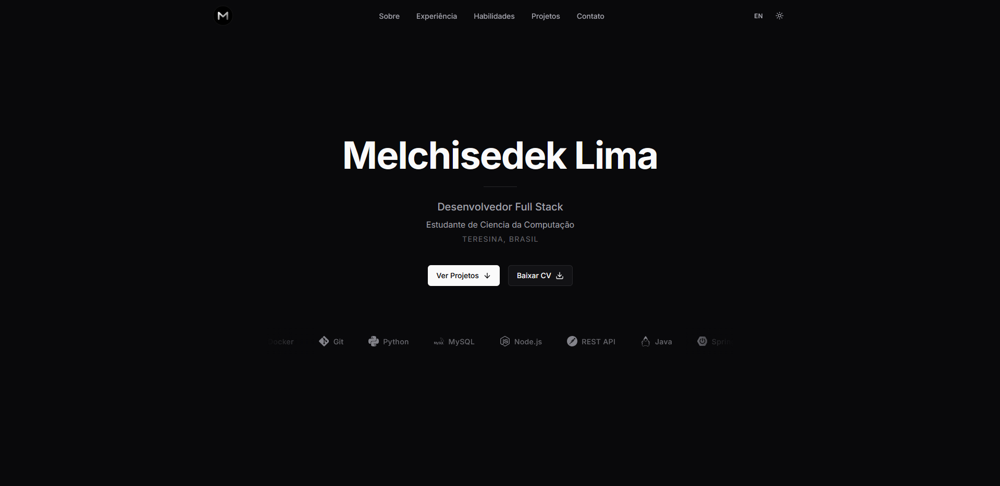
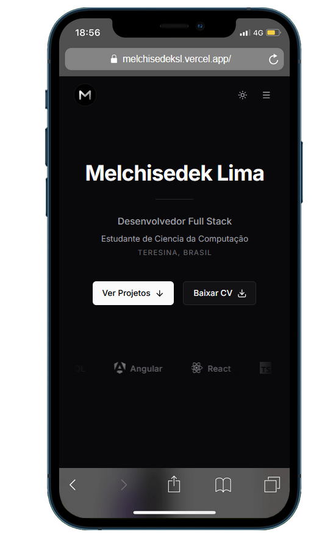

# Dev Portfolio

Portfólio profissional desenvolvido com Next.js, React e Tailwind CSS — apresentação, projetos e formulário de contato com envio de e-mail.

---

## Sobre o projeto

Site one-page com seções de **Hero**, **Sobre**, **Experiência**, **Habilidades**, **Projetos** e **Contato**. Inclui tema claro/escuro, suporte a PT-BR e EN, animações com Framer Motion e página dedicada para listagem de todos os projetos.

---

## Preview

*Adicione capturas de tela do seu portfólio na pasta `docs/` e referencie abaixo.*

### Desktop — Hero e navegação

<!-- IMAGEM: Hero e header em desktop (recomendado: 1200x700px) -->


### Mobile — Menu e seções

<!-- IMAGEM: Layout mobile com menu aberto (recomendado: 400x800px) -->


### Página de projeto

<!-- IMAGEM: Detalhe de um projeto (recomendado: 1200x700px) -->


---

## Funcionalidades

- **Multi-idioma** — Português (pt-BR) e Inglês
- **Tema claro/escuro** — com transição suave
- **Formulário de contato** — envio real de e-mail (Resend), rate limit e validação
- **Página de projetos** — listagem na home + página `/projects/all`
- **Detalhe por projeto** — rota `/projects/[slug]` com overview, stack e links
- **Layout responsivo** — header com menu hamburger e sidebar no mobile
- **Animações** — Framer Motion em seções e cards

---

## Stack

| Categoria   | Tecnologias |
| ----------- | ----------- |
| Framework   | Next.js 16 (App Router) |
| UI         | React 19, TypeScript, Tailwind CSS 4 |
| Animações  | Framer Motion |
| Formulário | React Hook Form, Zod |
| E-mail     | Resend |
| Analytics  | Vercel Analytics |

---

## Como rodar

### Pré-requisitos

- Node.js 18+
- npm (ou pnpm/yarn)

### Instalação

```bash
# Clone o repositório
git clone https://github.com/SEU_USUARIO/dev-portfolio.git
cd dev-portfolio

# Instale as dependências
npm install

# Copie o exemplo de variáveis de ambiente
cp .env.example .env.local
```

Edite `.env.local` e configure pelo menos:

- `RESEND_API_KEY` — chave da API em [Resend](https://resend.com) (para o formulário de contato)
- `CONTACT_EMAIL` — e-mail que receberá as mensagens

### Desenvolvimento

```bash
npm run dev
```

Acesse [http://localhost:3000](http://localhost:3000).

### Build para produção

```bash
npm run build
npm run start
```

---

## Scripts

| Comando         | Descrição                    |
| --------------- | ---------------------------- |
| `npm run dev`   | Servidor de desenvolvimento  |
| `npm run build` | Build para produção          |
| `npm run start` | Servidor de produção         |
| `npm run lint`  | Executa o ESLint             |

---

## Deploy (Vercel)

1. Acesse [vercel.com](https://vercel.com) e faça login com o GitHub.
2. **Add New** → **Project** e importe o repositório `dev-portfolio`.
3. Em **Settings** → **Environment Variables** adicione:
   - `RESEND_API_KEY`
   - `CONTACT_EMAIL` (ex.: `seu@email.com`)
   - (Opcional) `FROM_EMAIL` — use um domínio verificado no Resend em produção.
4. Clique em **Deploy**. O Next.js é detectado automaticamente.

Para domínio customizado: **Settings** → **Domains**.

---

## Estrutura de imagens do README

Para as imagens de preview aparecerem no README, crie a pasta `docs/` na raiz do projeto e adicione:

| Arquivo             | Sugestão de conteúdo                    |
| ------------------- | --------------------------------------- |
| `docs/preview-hero.png`   | Hero + header em desktop                |
| `docs/preview-mobile.png` | Tela mobile (ex.: menu aberto)         |
| `docs/preview-project.png`| Página de detalhe de um projeto         |

Formatos aceitos: `.png`, `.jpg`, `.webp`. Tamanhos sugeridos estão nos comentários `<!-- IMAGEM: ... -->` no README.

---

## Publicar no GitHub

Se este repositório ainda não estiver no GitHub:

1. Crie um repositório em [github.com/new](https://github.com/new) com o nome **dev-portfolio** (público, sem README).
2. Execute:

```bash
git remote add origin https://github.com/SEU_USUARIO/dev-portfolio.git
git push -u origin main
```

Substitua `SEU_USUARIO` pelo seu usuário do GitHub.

---

## Licença

Projeto de portfólio pessoal. Sinta-se à vontade para usar como base para o seu.
